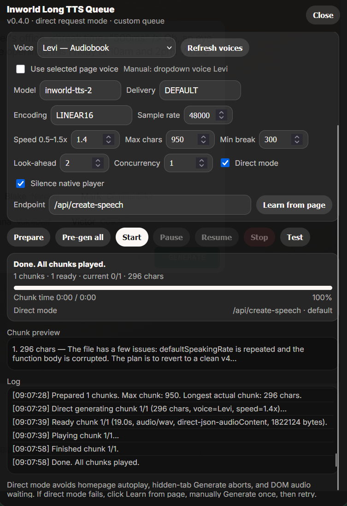
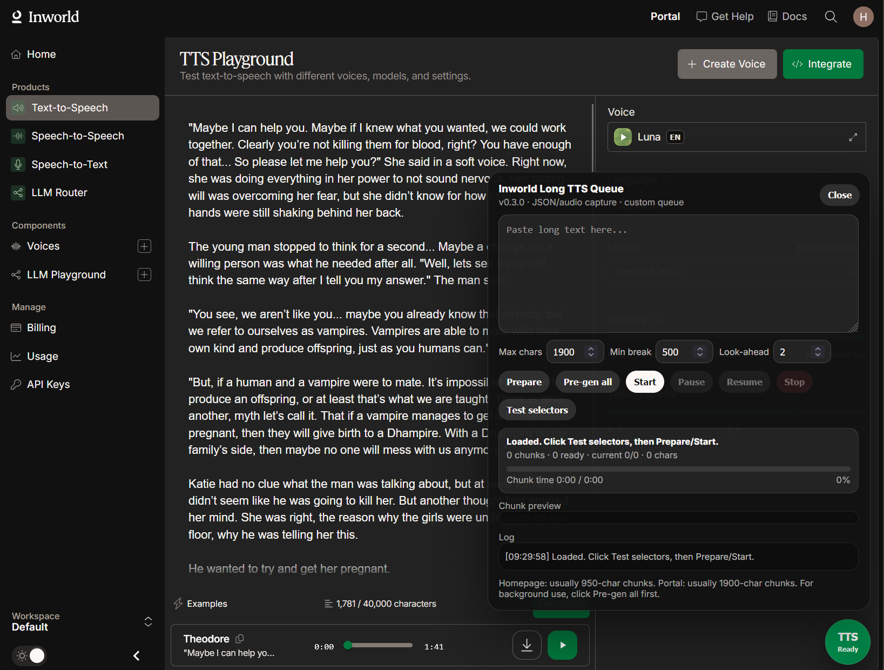

# VoxInfinity

VoxInfinity is a pair of userscripts for long-form text-to-speech experiments.
It splits long text into smaller chunks, generates audio for each chunk, and
plays the generated clips through its own queue.

## Recommended mode

Use `VoxInfinity Direct API` first. It is the main script and is usually the
best option because it sends speech requests directly instead of clicking
through the page UI for every chunk.

The target voice website expects requests to come from an active page session.
Keep the TTS tab open and active while generating. If you want smoother playback
or need to leave the tab later, click `Pre-gen all` while the tab is active so
the queue is prepared first.

This does not make the playground free or unlimited. VoxInfinity can queue long
text and work around the per-request character limit by splitting text into
chunks, but the site's account, quota, or free-credit limits still apply. Once
the free credits run out, generation will stop or fail the same way it does in
the normal playground.

Use the screenshots below to identify the platform name and confirm you are on
the intended TTS website/page before installing or troubleshooting.

<p>
  
  
</p>

## What is included

- `scripts/vox-infinity-direct-api.user.js` - Direct API mode. Install this
  first.
- `scripts/vox-infinity-dom-automation.user.js` - DOM Automation mode. Use this
  fallback if direct API mode cannot learn or send the speech request reliably.
- `configure.py` - fills in the checked-in `TARGET_DOMAIN` and `TARGET_MODEL`
  placeholders before installation.

## Install

1. Install a userscript manager such as Tampermonkey.
2. From the repository root, run:

   ```bash
   python3 configure.py
   ```

3. Open `scripts/vox-infinity-direct-api.user.js` in your browser and install
   it.
4. Open the target TTS page. The `VoxInfinity` button appears in the lower-right
   corner when the page is supported.

Do not install the scripts before running `configure.py`; the checked-in files
use placeholder match rules.

## Use

1. Open the target TTS page.
2. Click `VoxInfinity`.
3. Paste long text into the panel.
4. Click `Prepare` to split it into chunks.
5. Click `Start`.
6. Keep the tab active while the site accepts API/generation requests.
7. Optional but recommended for long text: click `Pre-gen all` first while the
   tab is active, then play the prepared queue.

## Notes

- Direct API mode sends chunks through the learned/default speech endpoint.
- DOM Automation mode clicks the page's normal generate flow and captures the
  returned audio.
- Keep the tab visible while DOM Automation mode is generating; background tabs
  can delay browser automation and media capture.

## Disclaimer

This is an experimental research project. Use it only where you are allowed to
automate the target site, and respect the site's terms and usage limits.
