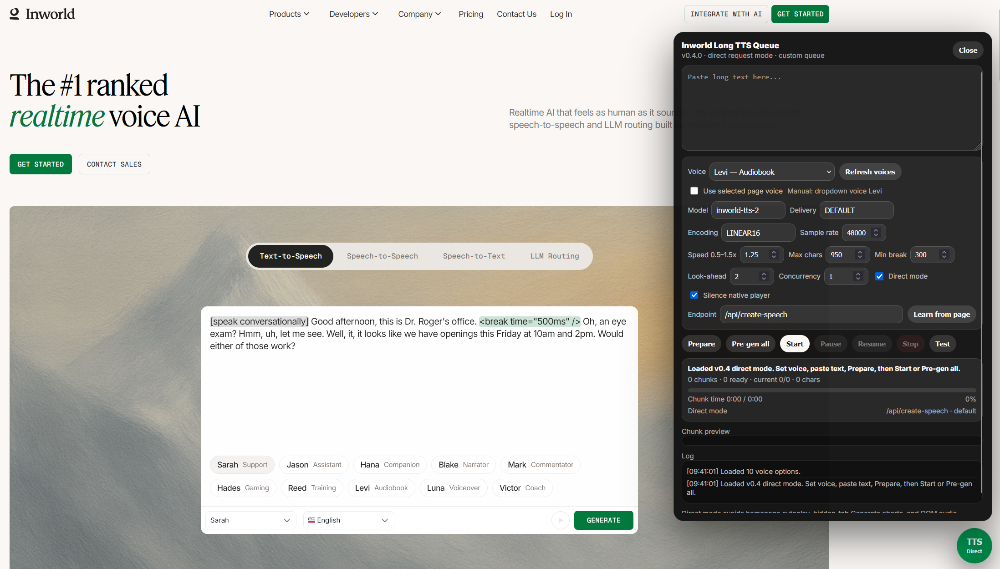

# VoxInfinity

Personal experiment with userscripts for long-form text-to-speech. It splits
long text into chunks, sends each chunk to the supported TTS page, and plays the
audio back as one queue.

Use the image to identify the platform and the intended homepage widget.

<p>
  
</p>

<p>
  
  
</p>

## Which script to use

- `scripts/vox-infinity-direct-api.user.js` - recommended. Tested with the
  homepage widget only. This is the script intended for the free/unlimited
  homepage-widget experiment.
- `scripts/vox-infinity-dom-automation.user.js` - UI/DOM fallback. It supports
  the homepage too and should also work with the playground, but I only tested
  it lightly and did not find an obvious issue.

The playground is supported and can give better quality, but it follows the
platform's normal account, quota, and free-credit limits. The homepage widget is
the free/unlimited target for this experiment.

## Setup

1. Install a userscript manager such as Tampermonkey.
2. From the repo root, run:

   ```bash
   python3 configure.py
   ```

3. Install `scripts/vox-infinity-direct-api.user.js`.
4. Open the supported TTS homepage or playground.

Run `configure.py` before installing. The checked-in scripts use
`TARGET_DOMAIN` and `TARGET_MODEL` placeholders on purpose.

## Use

1. Open the TTS page and keep the tab active.
2. Click `VoxInfinity`.
3. Paste your long text.
4. Click `Prepare`.
5. Click `Start`, or click `Pre-gen all` first for long text.

The page expects generation/API calls to come from an active browser session. If
you want to leave the tab later, use `Pre-gen all` while the tab is active.

## Notes

- This bypasses per-request character limits by queueing chunks.
- This does not bypass paid playground limits, account limits, or credits.
- Direct API mode is the tested homepage-widget path.
- DOM Automation mode is experimental and less tested.
- This is not a polished product; it is just my experiment.
